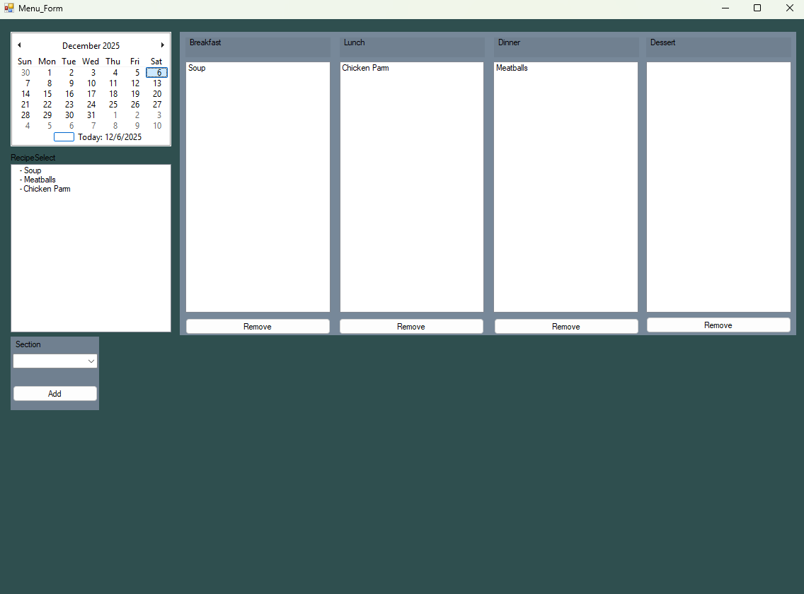
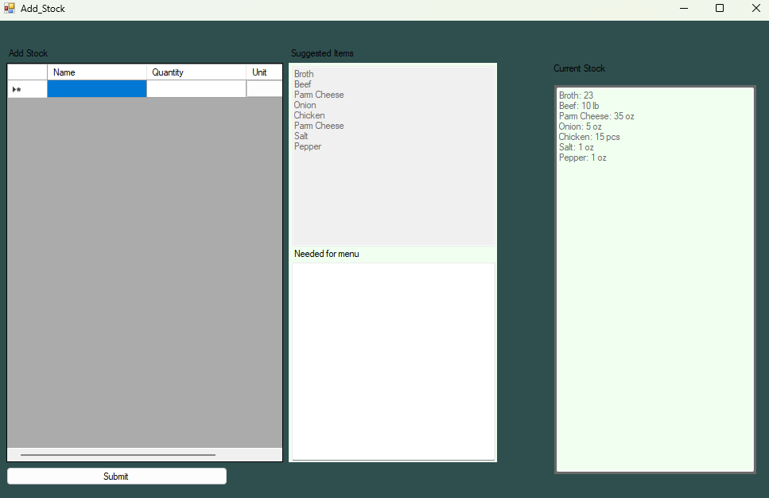
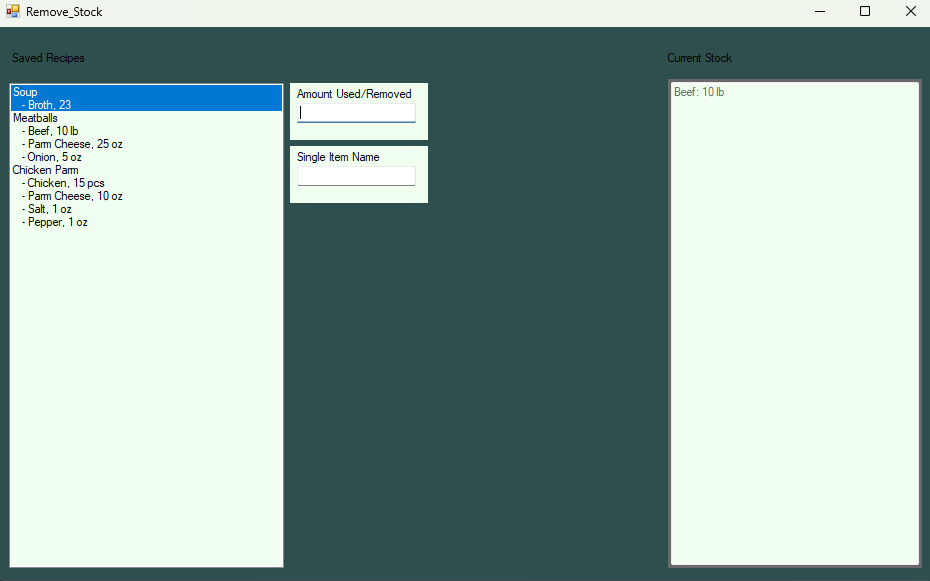
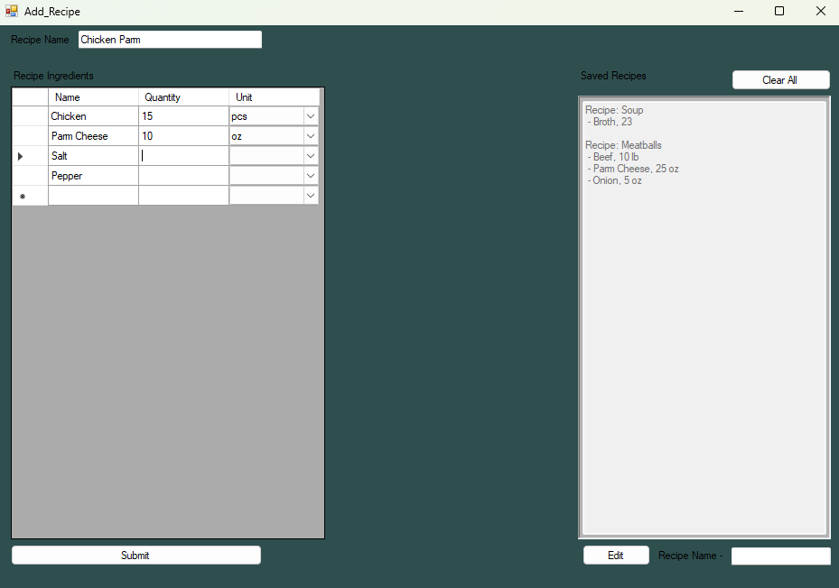

# Inventory Manager

Inventory Manager is a robust and user-friendly desktop application designed to streamline inventory tracking and management. Built with C# and .NET, it provides an intuitive interface for managing products, monitoring stock levels, and generating reports efficiently.

## Features

Product Management: Add, edit, and remove products with detailed information, including name, category, quantity, and price.

Stock Monitoring: Real-time updates on stock levels to prevent overstocking or stockouts.

Search & Filtering: Quickly locate products with built-in search and filter capabilities.

Reports & Analytics: Generate inventory summaries and reports for better decision-making.

User-Friendly Interface: Designed for ease of use, with clear navigation and responsive design.

## Technologies Used

Language: C#

Framework: .NET / .NET Core

Database: SQLite

UI: Windows Forms

## Installation

Clone the repository:

git clone https://github.com/CoryWolf55/Inventory-Manager.git

Open the solution file in Visual Studio.

Restore NuGet packages.

Build and run the project.

## Usage

Launch the application.

Use the Add Product button to input new items into the inventory.

Track and manage existing stock using the Edit, Delete, or Search options.

Export or view reports to analyze your inventory data.

## Screenshots / Demo

Here’s a quick look at the Inventory Manager interface:

**Menu Form**  
  

**Add/Edit Product Form**  
  

**Remove/Edit Product Form**  
  

**Add/Remove Recipe Form**  
 

## Contributing

Contributions are welcome! Please follow these steps:

Fork the repository.

Create a new branch:

git checkout -b feature/YourFeature

Make your changes and commit them:

git commit -m "Add some feature."

Push to the branch:

git push origin feature/YourFeature

Open a pull request.

## License

This project is licensed under the MIT License – see the LICENSE
 file for details.
